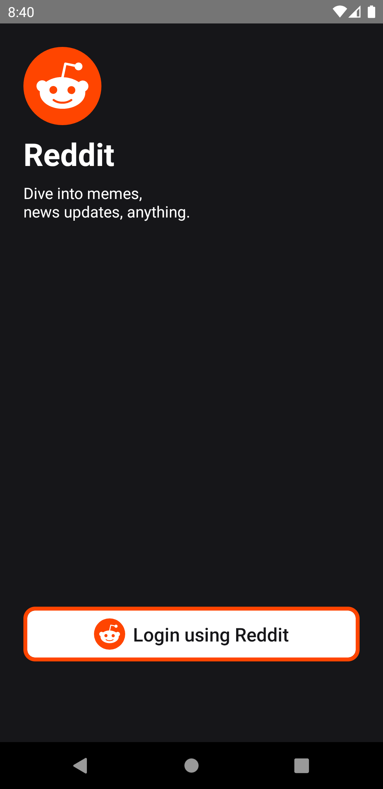
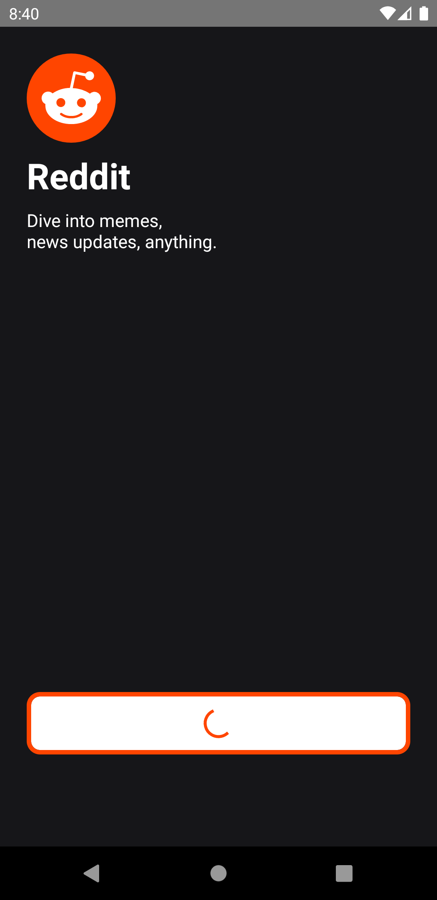
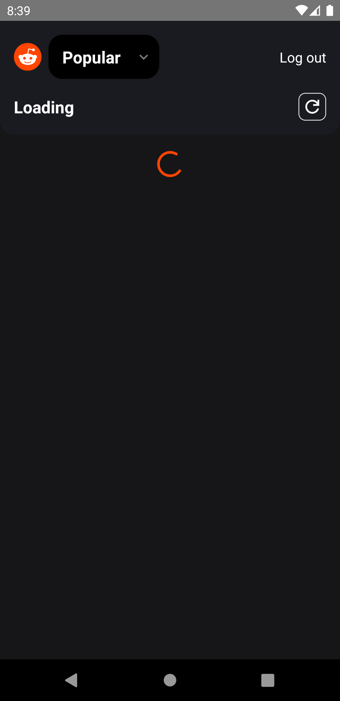

# Reddit Clone

Reddit Clone using React Native and Reddit APIs that lets you login using your Reddit and view your subscribed subreddits.


## Installation

[Click to Download APK](https://github.com/McMohanCycle/RedditClone/raw/main/RedditClone.apk)


## Run Locally

Clone the project

```bash
  git clone https://github.com/McMohanCycle/RedditClone
```

Go to the project directory

```bash
  cd RedditClone
```

Install dependencies

```bash
  yarn install
```

Start the server

```bash
  npx react-native start
```

Run on Android

```bash
  npx react-native run-android
```
## Screenshots







